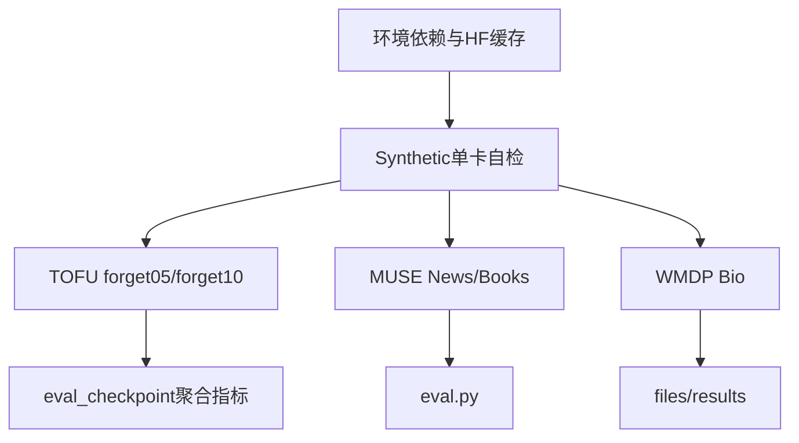

# SimNPO 实验流程指南（实战复现版）

本文档基于本机 AutoDL 环境实测整理，目标是复现论文 *Simplicity Prevails: Rethinking Negative Preference Optimization for LLM Unlearning* 中的 **SimNPO** 实验。  
所有大文件（模型缓存、训练结果、日志）统一放在 `/root/autodl-tmp`，**不要写系统盘**。

仓库根目录：`/usr/local/Unlearn-Simple`

## 0. 概览与仓库地图

| 目录 | 作用 | 规模 |
|------|------|------|
| `synthetic/` | 合成数据小模型，**环境自检** | 单卡，分钟级 |
| `TOFU/` | 虚构作者 QA 遗忘基准 | 6 卡 DeepSpeed |
| `MUSE/` | News / Books 语料遗忘 | 多卡 |
| `WMDP/` | 危险知识（Bio）遗忘 | 多卡 |



推荐顺序：**先 Synthetic 通关 → 再 TOFU → 再 MUSE / WMDP**。

---

## 1. 环境与依赖

### 1.1 CUDA 校验

```bash
python -c "import torch; print(torch.cuda.device_count()); print(torch.cuda.get_device_name(0))"
```

本机实测：6 张 GPU 可用。

### 1.2 Python 依赖

统一用 TOFU 的 requirements（已 pin 兼容版本）：

```bash
cd /usr/local/Unlearn-Simple
pip install -r TOFU/requirements.txt
pip install deepspeed   # 若未装上
```

**关键约束：**

- 必须使用 `transformers==4.46.3`（更新版本会去掉 `logging_dir`，并改变 `AdamW` 导入路径）
- 已包含 `scikit-learn`（Synthetic 需要）

### 1.3 HuggingFace 环境脚本

每次开新终端先加载：

```bash
source /root/autodl-tmp/env_hf.sh
```

脚本要点（文件位于 `/root/autodl-tmp/env_hf.sh`）：

```bash
export HF_ENDPOINT=https://hf-mirror.com
export HF_HOME=/root/autodl-tmp/huggingface
export HUGGINGFACE_HUB_CACHE=/root/autodl-tmp/huggingface/hub
export TRANSFORMERS_CACHE=/root/autodl-tmp/huggingface/hub
# 从仓库根目录 .env 读取 HuggingFace_token=
export HF_TOKEN=...
export HUGGINGFACE_HUB_TOKEN="$HF_TOKEN"
```

在仓库根目录准备 `.env`（勿提交 git）：

```bash
# /usr/local/Unlearn-Simple/.env
HuggingFace_token=hf_xxxxxxxx
```

### 1.4 磁盘约定

| 挂载点 | 用途 | 说明 |
|--------|------|------|
| `/root/autodl-tmp`（约 300G） | HF 缓存、TOFU/MUSE 结果、日志 | **唯一允许放大文件的位置** |
| `/` overlay（约 30G） | 系统与代码 | 禁止放模型/checkpoint |

目录规划：

```text
/root/autodl-tmp/
├── huggingface/hub/     # 模型与数据集缓存
├── TOFU_results/        # TOFU 训练与评测输出
├── logs/                # 训练日志
└── env_hf.sh
```

### 1.5 下载实验所需模型

```bash
source /root/autodl-tmp/env_hf.sh
python - <<'PY'
import torch
from transformers import AutoTokenizer, AutoModelForCausalLM

# TOFU
AutoTokenizer.from_pretrained('NousResearch/Llama-2-7b-chat-hf')
AutoModelForCausalLM.from_pretrained('locuslab/tofu_ft_llama2-7b', torch_dtype=torch.bfloat16)

# MUSE targets
AutoModelForCausalLM.from_pretrained('muse-bench/MUSE-News_target', torch_dtype=torch.bfloat16)
AutoModelForCausalLM.from_pretrained('muse-bench/MUSE-Books_target', torch_dtype=torch.bfloat16)
# tokenizer：优先 meta-llama；若 403，改用下方 ungated 替代
try:
    AutoTokenizer.from_pretrained('meta-llama/Llama-2-7b-hf')
except Exception as e:
    print('meta-llama gated, fallback:', e)
    AutoTokenizer.from_pretrained('NousResearch/Llama-2-7b-hf')

# WMDP
AutoModelForCausalLM.from_pretrained('HuggingFaceH4/zephyr-7b-beta', torch_dtype=torch.bfloat16)
print('done')
PY
```

TOFU 微调模型本地快照路径（下文会用到）：

```text
/root/autodl-tmp/huggingface/hub/models--locuslab--tofu_ft_llama2-7b/snapshots/8fa500e8f345f1dd9cfe95bb4689878c944c9cbd
```

---

## 2. Synthetic（环境自检，单卡）

```bash
cd /usr/local/Unlearn-Simple/synthetic
```

### 2.1 生成合成数据

```bash
python generate_data.py \
  --state_size 10 \
  --seq_length_retain 20 \
  --seq_length_forget1 20 \
  --seq_length_forget2 20 \
  --num_retain_sequences 10000 \
  --num_forget_sequences1 5000 \
  --num_forget_sequences2 5000 \
  --data_dir data \
  --seed 42 \
  --test_size 0.2 \
  --leakage 0.2
```

### 2.2 预训练小模型

```bash
python train.py \
  --state_size 10 \
  --seq_length_retain 20 \
  --seq_length_forget1 20 \
  --seq_length_forget2 20 \
  --num_retain_sequences 10000 \
  --num_forget_sequences1 5000 \
  --num_forget_sequences2 5000 \
  --data_dir data \
  --leakage 0.2 \
  --n_embd 128 \
  --n_layer 4 \
  --n_head 4 \
  --activation softmax \
  --seed 42 \
  --batch_size 128 \
  --epochs 5 \
  --learning_rate 0.0005 \
  --model_type pretrain \
  --only_forget1
```

### 2.3 SimNPO 遗忘训练

```bash
python unlearn.py \
  --state_size 10 \
  --seq_length_retain 20 \
  --seq_length_forget1 20 \
  --seq_length_forget2 20 \
  --num_retain_sequences 10000 \
  --num_forget_sequences1 5000 \
  --num_forget_sequences2 5000 \
  --data_dir data \
  --leakage 0.2 \
  --n_embd 128 \
  --n_layer 4 \
  --n_head 4 \
  --activation softmax \
  --pretraining_batch_size 128 \
  --pretraining_epochs 5 \
  --pretraining_learning_rate 0.0005 \
  --loss_type simnpo \
  --seed 42 \
  --unlearning_epochs 1 \
  --batch_size 4 \
  --learning_rate 0.0005 \
  --beta 1.0 \
  --max_iterations 50 \
  --use_retrain_eval
```

跑通即说明 PyTorch / CUDA / 本仓库代码路径正常。产物默认在 `synthetic/data/`、`synthetic/models/`、`synthetic/record/`（已加入 `.gitignore`）。

**本仓库已做的兼容修复：**

- `AdamW` 从 `torch.optim` 导入（`train.py` / `unlearn.py`）
- `loss_type` 支持别名映射（`simnpo` → `SimNPO`）

---

## 3. TOFU（多卡 DeepSpeed）

### 3.1 配置检查

编辑 `TOFU/config/forget.yaml`，确保 `model_path` 指向**本地快照目录**（不要写 `paper_models/...` 或单纯的 HF repo id）：

```yaml
model_family: llama2-7b
model_path: /root/autodl-tmp/huggingface/hub/models--locuslab--tofu_ft_llama2-7b/snapshots/8fa500e8f345f1dd9cfe95bb4689878c944c9cbd
# ...
save_dir: /root/autodl-tmp/TOFU_results/${forget_loss}_${lr}_${split}_epoch${num_epochs}_batch${batch_size}_accum${gradient_accumulation_steps}_beta${beta}_gamma${gamma}_grad_diff_coeff${grad_diff_coeff}_ref${ref_policy}_eval${eval_steps}_seed${seed}_${run_index}
```

也可在命令行临时覆盖，无需改文件：

```bash
model_path=/root/autodl-tmp/huggingface/hub/models--locuslab--tofu_ft_llama2-7b/snapshots/8fa500e8f345f1dd9cfe95bb4689878c944c9cbd
```

`TOFU/config/model_config.yaml` 中 `llama2-7b`：

```yaml
flash_attention2: "false"
gradient_checkpointing: "true"
ft_model_path: "locuslab/tofu_ft_llama2-7b"
```

> `forget.py` 需要**本地目录**作为 `model_path`；写 HF repo id 会 `FileNotFoundError`。

### 3.2 forget05 训练

遗忘约 **5%** 数据；推荐超参 `npo_coeff=0.1375`，`beta=2.5`（`retain_set` 默认 `retain95`）。

```bash
source /root/autodl-tmp/env_hf.sh
mkdir -p /root/autodl-tmp/logs /root/autodl-tmp/TOFU_results
cd /usr/local/Unlearn-Simple/TOFU

master_port=18765
CUDA_VISIBLE_DEVICES=0,1,2,3,4,5 torchrun --nproc_per_node=6 --master_port=$master_port forget.py \
  --config-name=forget.yaml \
  split=forget05 npo_coeff=0.1375 beta=2.5 \
  > /root/autodl-tmp/logs/tofu_forget05_simnpo.log 2>&1
echo EXIT:$?

# 训练结束后清理 DeepSpeed 优化器态残留（若有）
find /root/autodl-tmp/TOFU_results -type d -name 'global_step*' -prune -exec rm -rf {} + 2>/dev/null || true
```

结果目录示例：

```text
/root/autodl-tmp/TOFU_results/simnpo_grad_diff_1e-05_forget05_epoch10_batch1_accum6_beta2.5_..._seed1001_1/checkpoint-55/
```

### 3.3 forget05 独立评测

若训练末尾评估失败，可用 `eval_checkpoint.py` 对已有权重补评：

```bash
source /root/autodl-tmp/env_hf.sh
cd /usr/local/Unlearn-Simple/TOFU

SAVE_DIR=/root/autodl-tmp/TOFU_results/simnpo_grad_diff_1e-05_forget05_epoch10_batch1_accum6_beta2.5_gamma0.0_grad_diff_coeff1.0_reffine_tuned_evalsteps_per_epoch_seed1001_1
CKPT=$SAVE_DIR/checkpoint-55

master_port=18772
CUDA_VISIBLE_DEVICES=0,1,2,3,4,5 torchrun --nproc_per_node=6 --master_port=$master_port eval_checkpoint.py \
  --config-name=forget.yaml \
  split=forget05 npo_coeff=0.1375 beta=2.5 \
  +unlearned_path=$CKPT \
  save_dir=$SAVE_DIR \
  +eval_step=55 \
  > /root/autodl-tmp/logs/tofu_forget05_eval.log 2>&1
echo EXIT:$?
```

注意：Hydra 里未预声明的键必须用 `+key=value`。

产出文件：

```text
$CKPT/aggregate_stat.txt
```

### 3.4 forget05 实测参考基线（本机）

| 指标 | 值 |
|------|-----|
| Model Utility | 0.603 |
| Forget Quality (KS p-value) | 8.06e-07 |
| Forget ROUGE | 0.368 |
| Retain ROUGE | 0.577 |
| curr_step | 55 |
| loss_type | simnpo_grad_diff |

### 3.5 forget10 训练

遗忘约 **10%** 数据；推荐超参 `npo_coeff=0.125`，`beta=4.5`，并显式指定 `retain_set=retain90`。

```bash
source /root/autodl-tmp/env_hf.sh
cd /usr/local/Unlearn-Simple/TOFU

master_port=18773
CUDA_VISIBLE_DEVICES=0,1,2,3,4,5 torchrun --nproc_per_node=6 --master_port=$master_port forget.py \
  --config-name=forget.yaml \
  split=forget10 retain_set=retain90 \
  npo_coeff=0.125 beta=4.5 \
  > /root/autodl-tmp/logs/tofu_forget10_simnpo.log 2>&1
echo EXIT:$?

find /root/autodl-tmp/TOFU_results -type d -name 'global_step*' -prune -exec rm -rf {} + 2>/dev/null || true
```

评测时把 `split` / `npo_coeff` / `beta` / `SAVE_DIR` / `CKPT` 换成 forget10 对应路径即可（步数一般为 `checkpoint-111`，以实际目录为准）。

### 3.6 forget05 vs forget10

| | forget05 | forget10 |
|--|----------|----------|
| 遗忘比例 | 约 5% | 约 10% |
| retain 集 | retain95 | retain90 |
| npo_coeff | 0.1375 | 0.125 |
| beta | 2.5 | 4.5 |
| 难度 | 相对更容易 | 遗忘更多，utility 更难保 |

---

## 4. MUSE（News / Books）

```bash
source /root/autodl-tmp/env_hf.sh
cd /usr/local/Unlearn-Simple/MUSE
```

### 4.1 拉取数据

```bash
python load_data.py
```

会在 `MUSE/data/{news,books}/` 下写出 knowmem / verbmem / privleak / raw。

### 4.2 SimNPO + GDR 训练

若 `meta-llama/Llama-2-7b-hf` 无权限，将 `--tokenizer_dir` 换成 `NousResearch/Llama-2-7b-hf`。

**News：**

```bash
cd /usr/local/Unlearn-Simple/MUSE/baselines
python unlearn.py \
  --algo simnpo_gdr \
  --model_dir muse-bench/MUSE-News_target \
  --tokenizer_dir NousResearch/Llama-2-7b-hf \
  --data_file ../data/news/raw/forget.txt \
  --retain_data_file ../data/news/raw/retain1.txt \
  --out_dir /root/autodl-tmp/MUSE_ckpt/news/simnpo_gdr \
  --max_len 2048 \
  --epochs 10 \
  --lr 1e-5 \
  --per_device_batch_size 4 \
  --beta 0.7 \
  --coeff 0.1 \
  --npo_coeff 1.0
```

**Books：**

```bash
python unlearn.py \
  --algo simnpo_gdr \
  --model_dir muse-bench/MUSE-Books_target \
  --tokenizer_dir NousResearch/Llama-2-7b-hf \
  --data_file ../data/books/raw/forget.txt \
  --retain_data_file ../data/books/raw/retain1.txt \
  --out_dir /root/autodl-tmp/MUSE_ckpt/books/simnpo_gdr \
  --max_len 2048 \
  --epochs 10 \
  --lr 1e-5 \
  --per_device_batch_size 4 \
  --beta 0.75 \
  --coeff 0.1 \
  --npo_coeff 1.0
```

本仓库已在 `MUSE/baselines/baselines/iterative.py` 设置 `save_total_limit=1`、`save_only_model=True`，避免 epoch checkpoint 撑满磁盘。

### 4.3 评测

论文设定：News / Books 均取 **epoch 10** 的 checkpoint。

```bash
cd /usr/local/Unlearn-Simple/MUSE

# 将 checkpoint 路径换成实际 epoch-10 目录
python eval.py \
  --model_dirs /root/autodl-tmp/MUSE_ckpt/news/simnpo_gdr/checkpoint-XXX \
  --names simnpo_gdr_news \
  --corpus news \
  --tokenizer_dir NousResearch/Llama-2-7b-hf \
  --out_file /root/autodl-tmp/logs/muse_news_simnpo.csv

python eval.py \
  --model_dirs /root/autodl-tmp/MUSE_ckpt/books/simnpo_gdr/checkpoint-XXX \
  --names simnpo_gdr_books \
  --corpus books \
  --tokenizer_dir NousResearch/Llama-2-7b-hf \
  --out_file /root/autodl-tmp/logs/muse_books_simnpo.csv
```

常用指标：`verbmem_f`、`privleak`、`knowmem_f`、`knowmem_r`。

---

## 5. WMDP

### 5.1 数据

按 [WMDP 官方说明](https://github.com/centerforaisafety/wmdp?tab=readme-ov-file) 下载 **WMDP-Bio**，放到：

```text
/usr/local/Unlearn-Simple/WMDP/files/data
```

模型 `HuggingFaceH4/zephyr-7b-beta` 需已按 §1.5 缓存好。

### 5.2 运行

```bash
source /root/autodl-tmp/env_hf.sh
cd /usr/local/Unlearn-Simple/WMDP
bash run_wmdp_unlearn.sh
```

脚本内部调用：

```bash
CUDA_VISIBLE_DEVICES=0,1,2,3 python src/exec/unlearn_model.py \
  --config-file configs/unlearn/wmdp/SimNPO.json
```

结果目录：

```text
./WMDP/files/results/unlearn_wmdp_bio/SimNPO
```

如磁盘紧张，可将结果目录软链到 `/root/autodl-tmp/`。

---

## 6. 踩坑速查表（本机已修复）

| 现象 | 原因 | 修复位置 / 做法 |
|------|------|-----------------|
| `TrainingArguments` 不认识 `logging_dir` | transformers 过新 | pin `transformers==4.46.3`（`TOFU/requirements.txt`） |
| `cannot import name 'AdamW' from 'transformers'` | 同上 | `synthetic/train.py`、`synthetic/unlearn.py`：`from torch.optim import AdamW` |
| `loss_type=simnpo` 不识别 | 大小写 | `synthetic/unlearn.py` / `unlearn_utils.py` 别名映射 |
| `FileNotFoundError: locuslab/tofu_ft_llama2-7b` | `model_path` 写成了 repo id | `forget.yaml` 改为本地 snapshot 绝对路径 |
| `compute_loss() got unexpected keyword argument 'num_items_in_batch'` | Trainer API 变更 | `TOFU/dataloader.py` 各 `compute_loss` 增加该可选参数 |
| DeepSpeed 写出几十 GB `global_step*` | 优化器态落盘 | `TOFU/forget.py`：`save_strategy="no"`；训练后 `find ... global_step* -exec rm -rf` |
| `Got unsupported ScalarType BFloat16` | bf16 不能直接 `.numpy()` | `TOFU/evaluate_util.py`、`TOFU/evals/eval_everything.py`：先 `.float()` |
| Hydra `Could not override 'unlearned_path'` | 配置未声明该键 | 命令行用 `+unlearned_path=...`、`+eval_step=...` |
| MUSE checkpoint 占满磁盘 | 每 epoch 全量保存 | `iterative.py`：`save_total_limit=1`、`save_only_model=True` |
| `meta-llama/...` 403 | gated repo | 申请权限 + token；或改用 `NousResearch/Llama-2-7b-hf` |
| flash-attn 编译极慢 / 失败 | 环境缺轮子 | `model_config.yaml` 中 `flash_attention2: "false"` |
| 系统盘写满 | 模型写到 `/` | 始终 `source env_hf.sh`，结果指向 `/root/autodl-tmp` |

---

## 7. 监控与清理

### 7.1 盯日志

```bash
# TOFU
tail -f /root/autodl-tmp/logs/tofu_forget05_simnpo.log
tail -f /root/autodl-tmp/logs/tofu_forget10_simnpo.log
tail -f /root/autodl-tmp/logs/tofu_forget05_eval.log

# 看进度条（日志里的 \r 需转行）
tr '\r' '\n' < /root/autodl-tmp/logs/tofu_forget10_simnpo.log | grep -E '%\||EXIT|Error|aggregate' | tail -20
```

### 7.2 看进程与磁盘

```bash
pgrep -af 'forget.py|torchrun|unlearn.py' | grep -v grep
df -h /root/autodl-tmp /
du -sh /root/autodl-tmp/huggingface/hub /root/autodl-tmp/TOFU_results 2>/dev/null
```

### 7.3 训练后清理

```bash
# DeepSpeed 优化器分片（可再生成，体积巨大）
find /root/autodl-tmp/TOFU_results -type d -name 'global_step*' -prune -exec rm -rf {} + 2>/dev/null || true

# 确认关键指标已写出
find /root/autodl-tmp/TOFU_results -name aggregate_stat.txt
cat /root/autodl-tmp/TOFU_results/*/checkpoint-*/aggregate_stat.txt
```

### 7.4 Git 注意

- 勿提交 `.env`、模型权重、`synthetic/data|models|record`、`*.pkl`、`*.pth`
- 代码与配置改动可 push；大数据留在 `/root/autodl-tmp`

---

## 附录：一键环境自检清单

```bash
# 1) GPU
python -c "import torch; assert torch.cuda.device_count()>=1; print('GPU OK', torch.cuda.device_count())"

# 2) transformers 版本
python -c "import transformers; assert transformers.__version__.startswith('4.46'); print(transformers.__version__)"

# 3) HF 缓存
source /root/autodl-tmp/env_hf.sh
ls "$HUGGINGFACE_HUB_CACHE" | head

# 4) TOFU 本地模型目录存在
ls /root/autodl-tmp/huggingface/hub/models--locuslab--tofu_ft_llama2-7b/snapshots/8fa500e8f345f1dd9cfe95bb4689878c944c9cbd | head

# 5) Synthetic 最短路径（可选）
cd /usr/local/Unlearn-Simple/synthetic && python -c "from torch.optim import AdamW; print('AdamW OK')"
```

全部通过后再开长训练任务。
